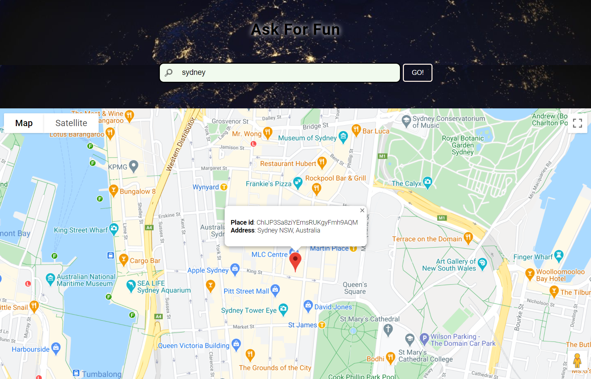

# Ask For Fun
Users input an address, click the "Go" button, then the place will be marked in the Google map. Click the marker, users can see the detailed place information in the information window.

## Checkout the live website below
[Ask For Fun](https://yingl1984.github.io/search_place/)

## Screenshots

## 2 APIs
1. Google Map API endpoint: https://maps.googleapis.com/maps/api
2. Google Geocode API endpoint: https://cors-anywhere.herokuapp.com/https://maps.googleapis.com/maps/api/geocode

## Built With
- Google API
- JQuery
- JSON
- HTML
- CSS

