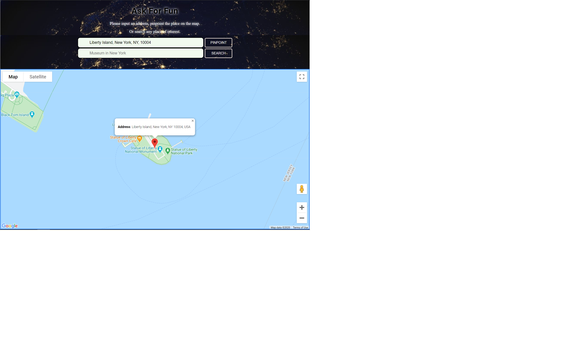
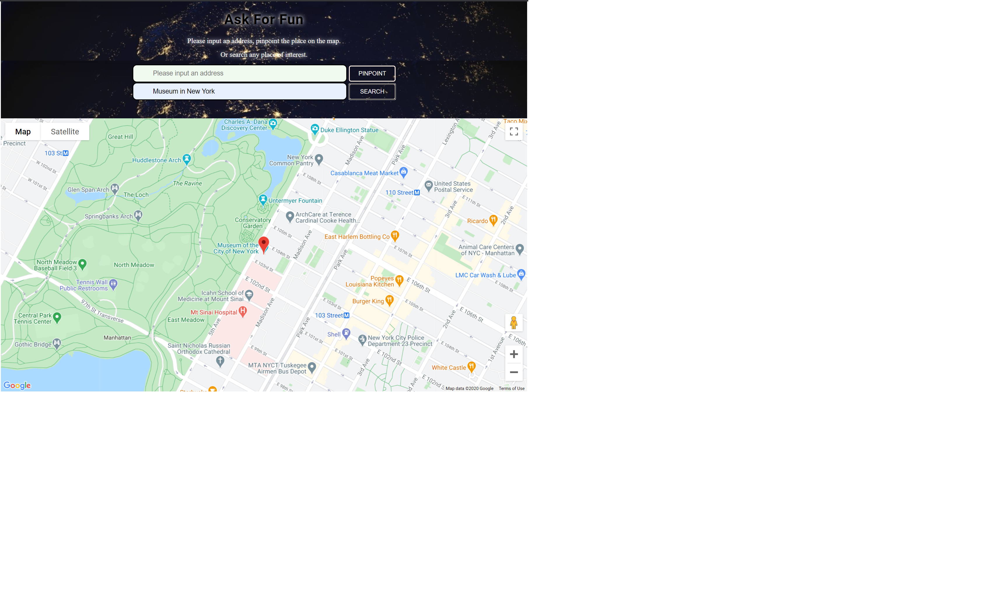

# Ask For Fun
2 unique features are provided within this project.
Feature 1: Users input an address, say "Liberty Island New York, NY 10004", click the "Pinpoint" button, the place will be marked in the Google map. Click the marker, users can see the detailed place information in the information window.

Feature 2: Users input something interested in, say "Museum in New York", click "Search" button, the result will be pinpointed on the map. Click the marker, users can see the detailed place information in the information window.

## Checkout the live website below
[Ask For Fun](https://yingl1984.github.io/search_place/)

## Screenshots
### Pinpoint the place on map

### Search place

## 3 APIs used in this app
1. Google Map API endpoint: 
https://maps.googleapis.com/maps/api
2. Google Place Details API endpoint:
https://maps.googleapis.com/maps/api/place/findplacefromtext
3. Google Geocode API endpoint: 
https://cors-anywhere.herokuapp.com/https://maps.googleapis.com/maps/api/geocode

## Built With
- Google API
- JQuery
- JSON
- HTML
- CSS

